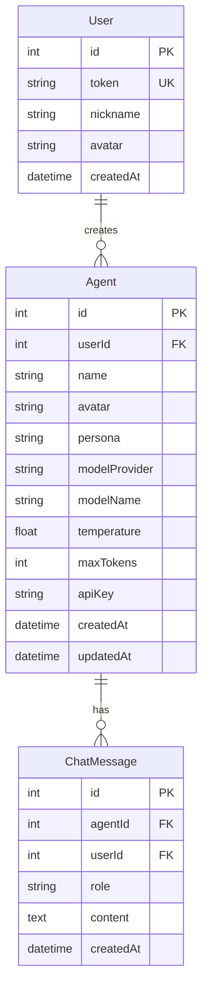

# 灵伴 — 技术架构文档

## 1. 架构设计

```mermaid
flowchart TD
    "A: 浏览器 React 前端" --> "B: Express API 服务器"
    "B" --> "C: Prisma ORM"
    "C" --> "D: SQLite 数据库"
    "B" --> "E: LLM API 代理"
    "E -->|OpenAI 兼容| F: 外部 LLM 服务"
```

## 2. 技术说明

- **前端**: React 18 + TypeScript + Tailwind CSS + Vite + Zustand(状态管理)
- **后端**: Express 4 + TypeScript (ESM)
- **数据库**: SQLite + Prisma ORM(无需外部数据库服务,适合沙箱环境)
- **LLM 代理**: 后端代理调用 OpenAI 兼容 API,使用智能体配置的 API key

## 3. 路由定义

| 路由 | 用途 |
|------|------|
| `/` | 主应用入口,重定向到对话页或登录 |
| `/chat` | 对话页面(选择智能体/聊天) |
| `/agents` | 智能体管理页面 |
| `/agents/new` | 创建智能体 |
| `/agents/:id/edit` | 编辑智能体 |
| `/profile` | 我的页面 |

## 4. API 定义

### 4.1 认证

```typescript
// POST /api/auth/anonymous
// 匿名登录,创建新用户或返回已有用户
Request: {}
Response: {
  token: string;      // 用户认证 token
  user: {
    id: number;       // 递增 ID,从 1 开始
    nickname: string; // 昵称,默认 "用户{id}"
    avatar: string | null;
    createdAt: string;
  }
}

// GET /api/auth/me
// 获取当前用户信息
Headers: Authorization: Bearer {token}
Response: {
  user: { id, nickname, avatar, createdAt }
}

// PATCH /api/auth/me
// 更新用户信息
Body: { nickname?: string; avatar?: string }
Response: { user: { id, nickname, avatar, createdAt } }
```

### 4.2 智能体

```typescript
// GET /api/agents
// 获取当前用户的所有智能体
Response: {
  agents: Agent[]
}

// GET /api/agents/:id
Response: { agent: Agent }

// POST /api/agents
Body: {
  name: string;
  avatar: string | null;      // base64 或 URL
  persona: string;             // 人设/系统提示词
  modelProvider: string;       // "openai" | "anthropic" | "custom"
  modelName: string;           // 如 "gpt-4o-mini"
  temperature: number;         // 0-2
  maxTokens: number;           // 1-128000
  apiKey: string;              // 用户的 LLM API key
}
Response: { agent: Agent }

// PATCH /api/agents/:id
Body: Partial<CreateAgentBody>
Response: { agent: Agent }

// DELETE /api/agents/:id
Response: { success: boolean }
```

### 4.3 对话

```typescript
// GET /api/chat/sessions
// 获取用户的对话会话列表
Response: {
  sessions: ChatSession[]
}

// GET /api/chat/sessions/:agentId
// 获取与某智能体的对话历史
Response: {
  messages: ChatMessage[]
}

// POST /api/chat/:agentId
// 发送消息并获取流式回复
Body: { message: string }
Response: text/event-stream (SSE 流式)
```

### 4.4 头像上传

```typescript
// POST /api/upload/avatar
// 上传头像图片,返回 URL
Body: multipart/form-data { file: ImageFile }
Response: { url: string }
```

## 5. 服务器架构

```mermaid
flowchart TD
    "A: Express Router" --> "B: Auth Middleware"
    "B" --> "C: Route Handlers"
    "C" --> "D: /api/auth - 认证服务"
    "C" --> "E: /api/agents - 智能体服务"
    "C" --> "F: /api/chat - 对话服务"
    "C" --> "G: /api/upload - 文件服务"
    "D" --> "H: Prisma Client"
    "E" --> "H"
    "F" --> "H"
    "F" --> "I: LLM API 调用"
    "G" --> "J: 本地文件存储"
    "H" --> "K: SQLite"
```

## 6. 数据模型

### 6.1 数据模型定义



### 6.2 数据定义语言

```sql
CREATE TABLE User (
    id INTEGER PRIMARY KEY AUTOINCREMENT,
    token TEXT UNIQUE NOT NULL,
    nickname TEXT NOT NULL DEFAULT '',
    avatar TEXT,
    createdAt DATETIME NOT NULL DEFAULT CURRENT_TIMESTAMP
);

CREATE TABLE Agent (
    id INTEGER PRIMARY KEY AUTOINCREMENT,
    userId INTEGER NOT NULL,
    name TEXT NOT NULL,
    avatar TEXT,
    persona TEXT NOT NULL DEFAULT '',
    modelProvider TEXT NOT NULL DEFAULT 'openai',
    modelName TEXT NOT NULL DEFAULT 'gpt-4o-mini',
    temperature REAL NOT NULL DEFAULT 0.7,
    maxTokens INTEGER NOT NULL DEFAULT 4096,
    apiKey TEXT NOT NULL DEFAULT '',
    createdAt DATETIME NOT NULL DEFAULT CURRENT_TIMESTAMP,
    updatedAt DATETIME NOT NULL DEFAULT CURRENT_TIMESTAMP,
    FOREIGN KEY (userId) REFERENCES User(id)
);

CREATE TABLE ChatMessage (
    id INTEGER PRIMARY KEY AUTOINCREMENT,
    agentId INTEGER NOT NULL,
    userId INTEGER NOT NULL,
    role TEXT NOT NULL,
    content TEXT NOT NULL,
    createdAt DATETIME NOT NULL DEFAULT CURRENT_TIMESTAMP,
    FOREIGN KEY (agentId) REFERENCES Agent(id) ON DELETE CASCADE,
    FOREIGN KEY (userId) REFERENCES User(id)
);
```
